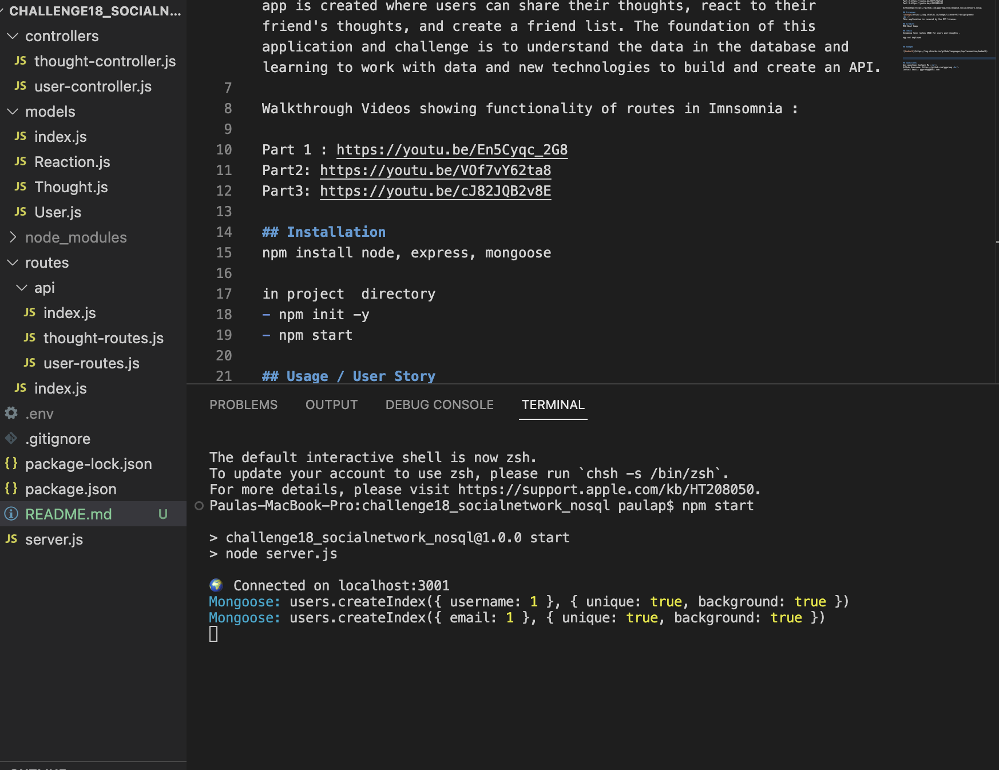
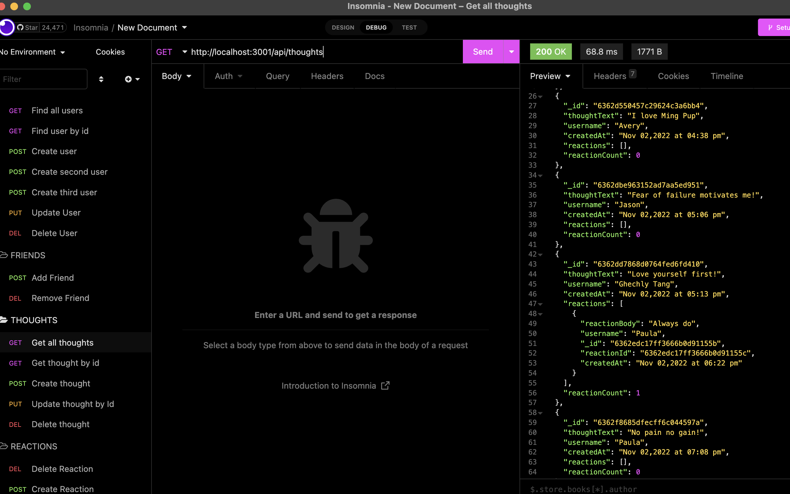

# Challenge 18 : NoSQL Challenge: Social Network API
   

## Description

Using Node, Express, npm , Mongoose ODM, and Javascript, a social network app is created where users can share their thoughts, react to their friend's thoughts, and create a friend list. The foundation of this application and challenge is to understand the data in the database and learning to work with data and new technologies to build and create an API.

Walkthrough Videos showing functionality of routes in Imnsomnia : 

Part 1 : https://youtu.be/En5Cyqc_2G8  
Part2: https://youtu.be/VOf7vY62ta8   
Part3: https://youtu.be/cJ82JQB2v8E  

## Installation
npm install node, express, mongoose

in project  directory
- npm init -y
- npm start

## Usage / User Story

AS A social media startup

I WANT an API for my social network that uses a NoSQL database

SO THAT my website can handle large amounts of unstructured data

## Acceptance Criteria from Module 18 Challenge
WHEN I enter the command to invoke the application
THEN my server is started and the Mongoose models are synced to the MongoDB database

WHEN I open API GET routes in Insomnia for users and thoughts
THEN the data for each of these routes is displayed in a formatted JSON

WHEN I test API POST, PUT, and DELETE routes in Insomnia
THEN I am able to successfully create, update, and delete users and thoughts in my database

WHEN I test API POST and DELETE routes in Insomnia
THEN I am able to successfully create and delete reactions to thoughts and add and remove friends to a user’s friend list

## Assets
These are example of working images of GET routes from users and thoughts in Insomnia and the start of invoke application.

## Contributions/Licenses/Links
Part 1 Video Walkthrough : https://youtu.be/En5Cyqc_2G8  
Part 2:https://youtu.be/VOf7vY62ta8   
Part 3:https://youtu.be/cJ82JQB2v8E  

GithubRepo:https://github.com/pppreap/challenge18_socialnetwork_nosql

## Licenses

 
This application is covered by the MIT license. 

## Credits
MSU Boot Camp

## Tests
Insomnia test routes CRUD for users and thoughts , 

app not deployed 

## Badges

## Questions
Any question Contact Me : 
Github Username: https://github.com/pppreap  
Contact Email: pppreap@gmail.com
